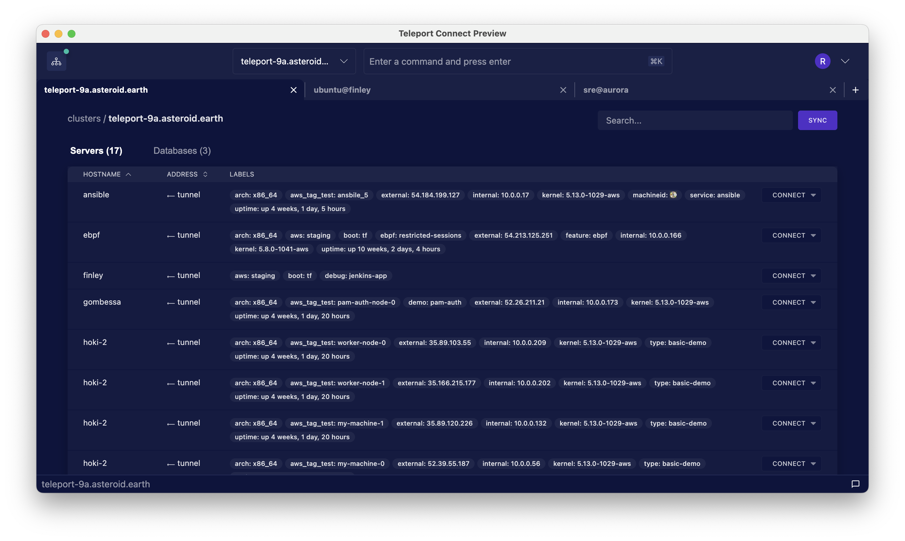

Teleport Connect provides easy and secure access to SSH servers and databases, with support for
other resources such as Kubernetes clusters and application access coming in the future.

## Installation & Upgrade

Head over to the [Downloads](https://goteleport.com/download/) page to download the most recent
version of Teleport Connect. As of now, Teleport Connect supports macOS only. Double-click the
downloaded .dmg file and drag the Teleport Connect icon to the Applications folder.

To upgrade Teleport Connect to a newer version, download the .dmg file with that version and then
follow the installation steps.

## Interface Overview

TODO

## Connecting to an SSH Server

TODO

## Connecting to a Database

TODO

### With a GUI Client

TODO

### With a CLI Client

TODO

## Connecting to Multiple Clusters

TODO

## Restarting and Reconnecting

TODO

## Troubleshooting

TODO
